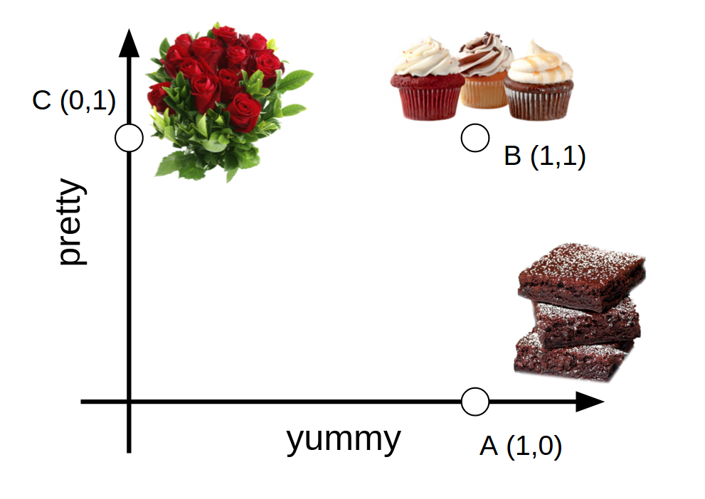
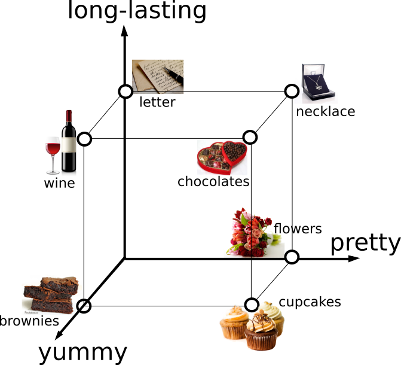

```{r}
knitr::opts_chunk$set(echo=F, warning=F, message=F)
```

```{r}
library(rwebppl)
library(ggplot2)
library(tidyr)
library(dplyr)
library(jsonlite)
library(ggthemes)
theme_new = theme_set(theme_few(base_size = 14))
```

## Central example: choosing a gift

Suppose an agent is choosing between 3 gifts: some kind of ugly but delicious brownies, some pretty but inedible flowers, and some adorable and delicious cupcakes. Here are these gifts in a 2D feature space of prettiness and yumminess:



Here are 4 possible utility functions that the agent could have and their corresponding distributions over choices.

```{r}
forward_model_basic = webppl(
  program_file = "gift-example-2d.wppl",
  inference_opts = list(method="MCMC", samples=4000),
  model_var = "forwardModel",
  data = data.frame(),
  data_var = "dataFromR",
  packages = c("./node_modules/explanations")
)
forward_model_basic %>%
  mutate(prettiness=ifelse(prettiness==1, 'should be pretty', "prettiness: meh"),
         yumminess=ifelse(yumminess==1, 'should be yummy', "taste: meh")) %>%
  ggplot(., aes(x=action, y=prob, fill=action, colour=action)) +
  geom_bar(stat='identity') +
  scale_fill_few() +
  scale_colour_few() +
  facet_grid(prettiness ~ yumminess) +
  theme(axis.text.x = element_text(angle = -45, hjust = 0)) +
  theme(legend.position="none") +
  xlab("choice of gift")
```

Now given a particular gift choice made under a particular utility function, we can ask which terms in the utility function were most reponsible for the agent's selection. (At this point, there is no null utterance).

```{r}
statesToExplainFromBasic = expand.grid(
  prettiness=c(0,1),
  yumminess=c(0,1),
  action=c("brownies", "cupcakes", "flowers")) %>%
  filter(!(prettiness==1 & action=="brownies")) %>%
  filter(!(yumminess==1 & action=="flowers"))
explanationPosteriorsBasic = webppl(
    program_file = "gift-example-2d.wppl",
    model_var = "explanationsModel",
    inference_opts = list(method="enumerate"),
    data = statesToExplainFromBasic,
    data_var = "dataFromR",
    packages = c("./node_modules/explanations")
  ) %>%
  # rescale so that given a state, total prob=1
  mutate(prob = prob*nrow(statesToExplainFromBasic))

explanationText = function(p, y, expl) {
  if (expl=="yumminess") {
    if (y==1) {
      return("b/c it should be yummy")
    } else {
      return("b/c taste doesn't matter")
    }
  } else {
    if (p==1) {
      return("b/c it should be pretty")
    } else {
      return("b/c prettiness doesn't matter")
    }
  }
}
# make some graphs!
explanationPosteriorsBasic %>%
  mutate(
    explanationText=mapply(explanationText,
                           prettiness,
                           yumminess,
                           explanation),
    prettinessCoef=ifelse(prettiness==1,
                          'should be pretty',
                          "prettiness: meh"),
    yumminessCoef=ifelse(yumminess==1,
                         'should be yummy',
                         "taste: meh")) %>%
  ggplot(., aes(x=action, y=prob, fill=explanation, colour=explanation)) +
  geom_bar(stat="identity", position="dodge") +
  geom_text(aes(label=explanationText,
                x=action,
                group=explanation,
                y=0),
            position=position_dodge(0.9),
            colour='black',
            angle=90,
            hjust=-0.05,
            size=2) +
  facet_grid(prettinessCoef ~ yumminessCoef) +
  scale_fill_few() +
  scale_colour_few() +
  theme(axis.text.x = element_text(angle = -45, hjust = 0))
```

In general, if we pick an option that's high in one of the dimensions we care about, we tend to explain choosing it with, "Because I care about the dimension it's good on." When we pick an options that's low on a dimension we don't care about, we explain choosing it with, "Because I don't care about the dimension it's low on." Because of our high rationality, we never pick anything that's low on a dimension we care about.

So this is one simple example that seems to have the kind of behavior I expect. Let's increase the complexity. There are many choices of where to go from here. I'll list a few:

* modify the options
    - add an option at the origin (done)
        * this will probably lead to a lot more symmetry, which might result in counterintuitively equally probable explanations (I was mistaken: everything looks the same)
    - add multiple options at a particular point in feature space (done)
    - subtract one or more options from the set of considered options
    - add options with fractional values in feature space
* change the possible utility functions
    - utility coefficients of features can be negative
    - certain coefficients are more likely than others
    - coeficients can have different magnitudes
* change the number of features
    - try 3 features next (done)
* open up agent's choices to more randomness
    - lower rationality
    - uncertainty about action outcomes (noisy consequences of actions)
    - multi-step action planning, i.e. some choices open up other future choices
        * e.g. have a map we can move through with different transition probabilities
* allow for other explanations
    - a null utterance
    - conjunctions and disjunctions
    - the feature values for different options.
    - explain in terms of available options. we could have a prior on whether the agent will have access to each choice.
        
## 3D Feature Space Example

Probably the simplest change to make is increasing the feature space to 3 dimensions. Let's add a "long-lasting" dimension.



Here's the forward model in this case, for the different utility functions (now there are 8 combinations of coefficients).

```{r}
forward_model3d = webppl(
  program_file = "gift-example-3d.wppl",
  inference_opts = list(method="MCMC", samples=4000),
  model_var = "forwardModel",
  data = data.frame(),
  data_var = "dataFromR",
  packages = c("./node_modules/explanations")
)
forward_model3d %>%
  mutate(utilityFunction = paste(prettiness, yumminess, shelfLife)) %>%
  ggplot(., aes(x=action, y=prob, fill=action, colour=action)) +
  geom_bar(stat='identity') +
  scale_fill_few() +
  scale_colour_few() +
  facet_wrap( ~ utilityFunction) +
  theme(axis.text.x = element_text(angle = -45, hjust = 0)) +
  theme(legend.position="none") +
  xlab("choice of gift")
```

And we can look at the explanations.

```{r}
statesToExplainFrom3d = expand.grid(
  prettiness=c(0,1),
  yumminess=c(0,1),
  shelfLife=c(0,1),
  action=c("brownies", "cupcakes", "flowers", "letter", "wine", "necklace", "chocolates")) %>%
  filter(!(prettiness==1 & action %in% c("brownies", "letter", "wine"))) %>%
  filter(!(yumminess==1 & action %in% c("flowers", "necklace", "letter"))) %>%
  filter(!(shelfLife==1 & action %in% c("cupcakes", "flowers", "brownies")))

explanationPosteriors3d = webppl(
    program_file = "gift-example-3d.wppl",
    model_var = "explanationsModel",
    inference_opts = list(method="enumerate"),
    data = statesToExplainFrom3d,
    data_var = "dataFromR",
    packages = c("./node_modules/explanations")
  ) %>%
  # rescale so that given a state, total prob=1
  mutate(prob = prob*nrow(statesToExplainFrom3d))

explanationPosteriors3d %>%
  mutate(utilityFunction = paste(prettiness, shelfLife, yumminess)) %>%
  ggplot(., aes(x=action, y=prob, fill=explanation, colour=explanation)) +
  geom_bar(stat="identity", position="dodge") +
  # geom_text(aes(label=explanationText,
  #               x=action,
  #               group=explanation,
  #               y=0),
  #           position=position_dodge(0.9),
  #           colour='black',
  #           angle=90,
  #           hjust=-0.05,
  #           size=2) +
  facet_wrap(~utilityFunction) +
  scale_fill_few() +
  scale_colour_few() +
  theme(axis.text.x = element_text(angle = -45, hjust = 0))
```

## 2D with origin

When I originally constructed the basic 2D example, I was motivated to leave the origin empty by some strange effects that I couldn't intuit the mechanism for. At the time, I put this down to the symmetry that the origin produced. Looking at the example now, though, it seems like the effects we saw for the 2D case without the origin are still at play when the origin is added. I might have been thinking of a situation where features can have negative utility.

```{r}
forward_model_origin = webppl(
  program_file = "gift-example-2d-symmetric.wppl",
  inference_opts = list(method="MCMC", samples=4000),
  model_var = "forwardModel",
  data = data.frame(),
  data_var = "dataFromR",
  packages = c("./node_modules/explanations")
)
forward_model_origin %>%
  mutate(prettiness=ifelse(prettiness==1, 'should be pretty', "prettiness: meh"),
         yumminess=ifelse(yumminess==1, 'should be yummy', "taste: meh")) %>%
  ggplot(., aes(x=action, y=prob, fill=action, colour=action)) +
  geom_bar(stat='identity') +
  scale_fill_few() +
  scale_colour_few() +
  facet_grid(prettiness ~ yumminess) +
  theme(axis.text.x = element_text(angle = -45, hjust = 0)) +
  theme(legend.position="none") +
  xlab("choice of gift")
```

Anyway, looking at the explanations when the origin is included, we still see that when an item is good on a dimension we care about, that explanation is rated highly, and when an item is bad on a dimension we don't care about, that explanation is also rated highly. When a dimension is good on a dimension that doesn't matter, an explanation in terms of that dimension is rated lower.

The new example at the origin doesn't appear to have a preferred explanation, since neither dimension matters when that option is chosen.

```{r}
statesToExplainFromOrigin = expand.grid(
  prettiness=c(0,1),
  yumminess=c(0,1),
  action=c("brownies", "cupcakes", "flowers", "letter")) %>%
  filter(!(prettiness==1 & action%in%c("brownies", "letter"))) %>%
  filter(!(yumminess==1 & action%in%c("flowers", "letter")))
explanationPosteriorsOrigin = webppl(
    program_file = "gift-example-2d-symmetric.wppl",
    model_var = "explanationsModel",
    inference_opts = list(method="enumerate"),
    data = statesToExplainFromOrigin,
    data_var = "dataFromR",
    packages = c("./node_modules/explanations")
  ) %>%
  # rescale so that given a state, total prob=1
  mutate(prob = prob*nrow(statesToExplainFromOrigin))

explanationText = function(p, y, expl) {
  if (expl=="yumminess") {
    if (y==1) {
      return("b/c it should be yummy")
    } else {
      return("b/c taste doesn't matter")
    }
  } else {
    if (p==1) {
      return("b/c it should be pretty")
    } else {
      return("b/c prettiness doesn't matter")
    }
  }
}
# make some graphs!
explanationPosteriorsOrigin %>%
  mutate(
    explanationText=mapply(explanationText,
                           prettiness,
                           yumminess,
                           explanation),
    prettinessCoef=ifelse(prettiness==1,
                          'should be pretty',
                          "prettiness: meh"),
    yumminessCoef=ifelse(yumminess==1,
                         'should be yummy',
                         "taste: meh")) %>%
  ggplot(., aes(x=action, y=prob, fill=explanation, colour=explanation)) +
  geom_bar(stat="identity", position="dodge") +
  geom_text(aes(label=explanationText,
                x=action,
                group=explanation,
                y=0),
            position=position_dodge(0.9),
            colour='black',
            angle=90,
            hjust=-0.05,
            size=2) +
  facet_grid(prettinessCoef ~ yumminessCoef) +
  scale_fill_few() +
  scale_colour_few() +
  theme(axis.text.x = element_text(angle = -45, hjust = 0))
```

## Doubled-up items in feature-space

Suppose there are two items at each point in feature space.

```{r}
forward_model_doubles = webppl(
  program_file = "gift-example-2d-doubles.wppl",
  inference_opts = list(method="MCMC", samples=4000),
  model_var = "forwardModel",
  data = data.frame(),
  data_var = "dataFromR",
  packages = c("./node_modules/explanations")
)
forward_model_doubles %>%
  mutate(prettiness=ifelse(prettiness==1, 'should be pretty', "prettiness: meh"),
         yumminess=ifelse(yumminess==1, 'should be yummy', "taste: meh")) %>%
  ggplot(., aes(x=action, y=prob, fill=action, colour=action)) +
  geom_bar(stat='identity') +
  scale_fill_few() +
  scale_colour_few() +
  facet_grid(prettiness ~ yumminess) +
  theme(axis.text.x = element_text(angle = -45, hjust = 0)) +
  theme(legend.position="none") +
  xlab("choice of gift")
```

Then the same principles apply, though contrasts between explanations get weaker. Note that adjacent items have similar explnation ratings that tend to match the corresponding single-item explanation ratings.

```{r}
statesToExplainFromDoubles = expand.grid(
  prettiness=c(0,1),
  yumminess=c(0,1),
  action=c("brownies", "cupcakes", "flowers", "wine", "necklace", "chocolates")) %>%
  filter(!(prettiness==1 & action%in%c("brownies", "wine"))) %>%
  filter(!(yumminess==1 & action%in%c("flowers", "necklace")))
explanationPosteriorsDoubles = webppl(
    program_file = "gift-example-2d-doubles.wppl",
    model_var = "explanationsModel",
    inference_opts = list(method="enumerate"),
    data = statesToExplainFromDoubles,
    data_var = "dataFromR",
    packages = c("./node_modules/explanations")
  ) %>%
  # rescale so that given a state, total prob=1
  mutate(prob = prob*nrow(statesToExplainFromDoubles))

# make some graphs!
explanationPosteriorsDoubles %>%
  mutate(
    explanationText=mapply(explanationText,
                           prettiness,
                           yumminess,
                           explanation),
    prettinessCoef=ifelse(prettiness==1,
                          'should be pretty',
                          "prettiness: meh"),
    yumminessCoef=ifelse(yumminess==1,
                         'should be yummy',
                         "taste: meh"),
    action=factor(action, levels=c("brownies", "wine", "cupcakes", "chocolates", "flowers", "necklace"))) %>%
  ggplot(., aes(x=action, y=prob, fill=explanation, colour=explanation)) +
  geom_bar(stat="identity", position="dodge") +
  geom_text(aes(label=explanationText,
                x=action,
                group=explanation,
                y=0),
            position=position_dodge(0.9),
            colour='black',
            angle=90,
            hjust=-0.05,
            size=2) +
  facet_grid(prettinessCoef ~ yumminessCoef) +
  scale_fill_few() +
  scale_colour_few() +
  theme(axis.text.x = element_text(angle = -45, hjust = 0))
```

When I first coded this up, something weird was happening. Because cupcakes and chocolates should have the same values, but they got very different ratings in my first simulation. I figured it out. Here's the bug: if the distribution of choices changes, we need to resample the uniform random variable. Otherwise there's weird dependencies between the latents.

One solution to this is to use different latents depending on the set of options we're choosing between. Then only if the same options are available does the exogenous randomness carry over. I went back and updated all previous models to have this design.

## Generalizations so far

```{r}
congruency = function(action, prettiness, yumminess, explanation, shelfLife) {
  if (explanation=="prettiness") {
    if (prettiness) {
      # prettiness is valued
      if (action %in% c("necklace", "flowers", "cupcakes", "chocolates")) { 
        return("high,valued") 
      } else { #impossible
        return("low,valued")
      }
    } else {
      # prettiness is not valued
      if (action %in% c("necklace", "flowers", "cupcakes", "chocolates")) { 
        return("high,unvalued") 
      } else { #impossible
        return("low,unvalued")
      }
    }
  } else if (explanation=="yumminess") {
    if (yumminess) {
      if (action %in% c("wine", "brownies", "chocolates", "cupcakes")) {
        return("high,valued")
      } else {
        return("low,valued")
      }
    } else {
      if (action %in% c("wine", "brownies", "chocolates", "cupcakes")) {
        return("high,unvalued")
      } else {
        return("low,unvalued")
      }
    }
  } else {
    if (shelfLife) {
      if (action %in% c("wine", "chocolates", "letter", "necklace")) {
        return("high,valued")
      } else {
        return("low,valued")
      }
    } else {
      if (action %in% c("wine", "chocolates", "letter", "necklace")) {
        return("high,unvalued")
      } else {
        return("low,unvalued")
      }
    }
  }
  return(NA)
}
explanationsSoFar = rbind(
  explanationPosteriorsBasic %>% mutate(utilityFn=paste(prettiness, yumminess),
                                        congruency=mapply(congruency, action, prettiness, yumminess, explanation, NA),
                                        setup="basic") %>% select(explanation, action, prob, utilityFn, setup, congruency),
  explanationPosteriors3d %>% mutate(utilityFn=paste(prettiness, yumminess, shelfLife),
                                        congruency=mapply(congruency, action, prettiness, yumminess, explanation, shelfLife),
                                     setup="3d") %>% select(explanation, action, prob, utilityFn, setup, congruency),
  explanationPosteriorsOrigin %>% mutate(utilityFn=paste(prettiness, yumminess),
                                        congruency=mapply(congruency, action, prettiness, yumminess, explanation, NA),
                                         setup="origin") %>% select(explanation, action, prob, utilityFn, setup, congruency),
  explanationPosteriorsDoubles %>% mutate(utilityFn=paste(prettiness, yumminess),
                                        congruency=mapply(congruency, action, prettiness, yumminess, explanation, NA),
                                          setup="doubles") %>% select(explanation, action, prob, utilityFn, setup, congruency))
```

Across all setups, if an action is high on a valued dimension, that valued dimension is a good explanation. If an action is low along an unvalued dimension, the *unvalued* dimension is a good explanation and the valued dimension is a bad explanation. This corresponds to the intuition that if an action is high on a particular dimension, we would pick it either by chance or because we care about that dimension.

```{r}
ggplot(explanationsSoFar, aes(x=congruency, y=prob, colour=setup)) +
  geom_point() +
  theme(axis.text.x = element_text(angle = -45, hjust = 0)) +
  scale_colour_few()
```

We can break this down even further in a much messier graph. One trend that pops out is that explanations referencing an unvalued dimension on which the action is high are always worse than high/valued or low/unvalued.

```{r}
ggplot(explanationsSoFar, aes(x=congruency, y=prob, colour=action, group=action)) +
  geom_point() +
  geom_line() +
  facet_wrap(utilityFn ~ setup) +
  theme(axis.text.x = element_text(angle = -45, hjust = 0)) +
  scale_colour_few()
```

## Allowing for a null utterance

I did kind of a hack and had one "explanation" to ensures there's no conditioning on the counterfactal (in the code, the meaning is "because false" so when we condition on the explanation being false in the counterfactal world, we're just conditioning on true).

No utterance doesn't seem to compete with either of the explanations. I looks kind of like when one explanation is obviously better than the other, the null utterance becomes slightly better, too.

One interesting observation is that the null utterance is that when the utility function places no value on either feature, the null utterance is almost as good as the two explanations for the item high on both dimensions, but when the utility funciton places value on both dimensions equally, the two explanations are equivalent to each other but much better than the null.

```{r}
statesToExplainFromNull = expand.grid(
  prettiness=c(0,1),
  yumminess=c(0,1),
  action=c("brownies", "cupcakes", "flowers")) %>%
  filter(!(prettiness==1 & action=="brownies")) %>%
  filter(!(yumminess==1 & action=="flowers"))
explanationPosteriorsNull = webppl(
    program_file = "gift-example-2d-null-utt.wppl",
    model_var = "explanationsModel",
    inference_opts = list(method="enumerate"),
    data = statesToExplainFromNull,
    data_var = "dataFromR",
    packages = c("./node_modules/explanations")
  ) %>%
  # rescale so that given a state, total prob=1
  mutate(prob = prob*nrow(statesToExplainFromNull))

# make some graphs!
explanationPosteriorsNull %>%
  mutate(
    explanationText=mapply(explanationText,
                           prettiness,
                           yumminess,
                           explanation),
    prettinessCoef=ifelse(prettiness==1,
                          'should be pretty',
                          "prettiness: meh"),
    yumminessCoef=ifelse(yumminess==1,
                         'should be yummy',
                         "taste: meh")) %>%
  ggplot(., aes(x=action, y=prob, fill=explanation, colour=explanation)) +
  geom_bar(stat="identity", position="dodge") +
  geom_text(aes(label=explanationText,
                x=action,
                group=explanation,
                y=0),
            position=position_dodge(0.9),
            colour='black',
            angle=90,
            hjust=-0.05,
            size=2) +
  facet_grid(prettinessCoef ~ yumminessCoef) +
  scale_fill_few() +
  scale_colour_few() +
  theme(axis.text.x = element_text(angle = -45, hjust = 0))
```

As a followup, I added another alternative utterance which exhastively enumerates the actual states of the world as the explanation. It's kind of cool that the highly ranked explanations are often slightly better than the exhaustive utterance. Causal selection?

```{r}
statesToExplainFromNull = expand.grid(
  prettiness=c(0,1),
  yumminess=c(0,1),
  action=c("brownies", "cupcakes", "flowers")) %>%
  filter(!(prettiness==1 & action=="brownies")) %>%
  filter(!(yumminess==1 & action=="flowers"))
explanationPosteriorsNull = webppl(
    program_file = "gift-example-2d-exhaustive-utt.wppl",
    model_var = "explanationsModel",
    inference_opts = list(method="enumerate"),
    data = statesToExplainFromNull,
    data_var = "dataFromR",
    packages = c("./node_modules/explanations")
  ) %>%
  # rescale so that given a state, total prob=1
  mutate(prob = prob*nrow(statesToExplainFromNull))

# make some graphs!
explanationPosteriorsNull %>%
  mutate(
    explanationText=mapply(explanationText,
                           prettiness,
                           yumminess,
                           explanation),
    prettinessCoef=ifelse(prettiness==1,
                          'should be pretty',
                          "prettiness: meh"),
    yumminessCoef=ifelse(yumminess==1,
                         'should be yummy',
                         "taste: meh")) %>%
  ggplot(., aes(x=action, y=prob, fill=explanation, colour=explanation)) +
  geom_bar(stat="identity", position="dodge") +
  geom_text(aes(label=explanationText,
                x=action,
                group=explanation,
                y=0),
            position=position_dodge(0.9),
            colour='black',
            angle=90,
            hjust=-0.05,
            size=2) +
  facet_grid(prettinessCoef ~ yumminessCoef) +
  scale_fill_few() +
  scale_colour_few() +
  theme(axis.text.x = element_text(angle = -45, hjust = 0))
```

## Asymmetric Doubles

What if there were tons of cupcake-like things, but only one brownie and we care about taste. Would that change our explanation for why we choose the brownie?

```{r}
forward_model_asymmetric = webppl(
  program_file = "gift-example-2d-asymmetric-doubles.wppl",
  inference_opts = list(method="MCMC", samples=4000),
  model_var = "forwardModel",
  data = data.frame(),
  data_var = "dataFromR",
  packages = c("./node_modules/explanations")
)
forward_model_asymmetric %>%
  mutate(prettiness=ifelse(prettiness==1, 'should be pretty', "prettiness: meh"),
         yumminess=ifelse(yumminess==1, 'should be yummy', "taste: meh")) %>%
  ggplot(., aes(x=action, y=prob, fill=action, colour=action)) +
  geom_bar(stat='identity') +
  scale_fill_few() +
  scale_colour_few() +
  facet_grid(prettiness ~ yumminess) +
  theme(axis.text.x = element_text(angle = -45, hjust = 0)) +
  theme(legend.position="none") +
  xlab("choice of gift")
```

```{r}
statesToExplainFromAsymmetricDoubles = expand.grid(
  prettiness=c(0,1),
  yumminess=c(0,1),
  action=c("cupcakes", "chocolates", "cake", "pie", "flowers", "brownies")) %>%
  filter(!(prettiness==1 & action%in%c("brownies"))) %>%
  filter(!(yumminess==1 & action%in%c("flowers")))
explanationPosteriorsAsymmetricDoubles = webppl(
    program_file = "gift-example-2d-asymmetric-doubles.wppl",
    model_var = "explanationsModel",
    inference_opts = list(method="enumerate"),
    data = statesToExplainFromAsymmetricDoubles,
    data_var = "dataFromR",
    packages = c("./node_modules/explanations")
  ) %>%
  # rescale so that given a state, total prob=1
  mutate(prob = prob*nrow(statesToExplainFromAsymmetricDoubles))

# make some graphs!
explanationPosteriorsAsymmetricDoubles %>%
  mutate(
    explanationText=mapply(explanationText,
                           prettiness,
                           yumminess,
                           explanation),
    prettinessCoef=ifelse(prettiness==1,
                          'should be pretty',
                          "prettiness: meh"),
    yumminessCoef=ifelse(yumminess==1,
                         'should be yummy',
                         "taste: meh")) %>%
  ggplot(., aes(x=action, y=prob, fill=explanation, colour=explanation)) +
  geom_bar(stat="identity", position="dodge") +
  geom_text(aes(label=explanationText,
                x=action,
                group=explanation,
                y=0),
            position=position_dodge(0.9),
            colour='black',
            angle=90,
            hjust=-0.05,
            size=2) +
  facet_grid(prettinessCoef ~ yumminessCoef) +
  scale_fill_few() +
  scale_colour_few() +
  theme(axis.text.x = element_text(angle = -45, hjust = 0))
```

Not getting a lot from that example...

## Fractional feature values

Let's add some fractional values.


```{r}
forward_model_fractional = webppl(
  program_file = "gift-example-2d-fractional-feature-values.wppl",
  inference_opts = list(method="MCMC", samples=4000),
  model_var = "forwardModel",
  data = data.frame(),
  data_var = "dataFromR",
  packages = c("./node_modules/explanations")
)
forward_model_fractional %>%
  mutate(prettiness=ifelse(prettiness==1, 'should be pretty', "prettiness: meh"),
         yumminess=ifelse(yumminess==1, 'should be yummy', "taste: meh")) %>%
  ggplot(., aes(x=action, y=prob, fill=action, colour=action)) +
  geom_bar(stat='identity') +
  facet_grid(prettiness ~ yumminess) +
  theme(axis.text.x = element_text(angle = -45, hjust = 0)) +
  theme(legend.position="none") +
  xlab("choice of gift")
```

This example probably won't be very interesting until we vary the rationality.

```{r}
# statesToExplainFromFractional = expand.grid(
#   prettiness=c(0,1),
#   yumminess=c(0,1),
#   action=c("cupcakes", "chocolateChipCookies", "fruitArrangement", "paperweight", "candy", "decoratedSugarCookies", "flowers", "brownies")) %>%
#   filter(!(prettiness==1 & action%in%c("brownies", "chocolateChipCookes", "fruitArrangement", "paperweight", "candy"))) %>%
#   filter(!(yumminess==1 & action%in%c("flowers", "fruitArrangement", "paperweight", "candy", "decoratedSugarCookies")))
# explanationPosteriorsFractional = webppl(
#     program_file = "gift-example-2d-asymmetric-doubles.wppl",
#     model_var = "explanationsModel",
#     inference_opts = list(method="enumerate"),
#     data = statesToExplainFromFractional,
#     data_var = "dataFromR",
#     packages = c("./node_modules/explanations")
#   ) %>%
#   # rescale so that given a state, total prob=1
#   mutate(prob = prob*nrow(statesToExplainFromFractional))
# 
# # make some graphs!
# explanationPosteriorsFractional %>%
#   mutate(
#     explanationText=mapply(explanationText,
#                            prettiness,
#                            yumminess,
#                            explanation),
#     prettinessCoef=ifelse(prettiness==1,
#                           'should be pretty',
#                           "prettiness: meh"),
#     yumminessCoef=ifelse(yumminess==1,
#                          'should be yummy',
#                          "taste: meh")) %>%
#   ggplot(., aes(x=action, y=prob, fill=explanation, colour=explanation)) +
#   geom_bar(stat="identity", position="dodge") +
#   geom_text(aes(label=explanationText,
#                 x=action,
#                 group=explanation,
#                 y=0),
#             position=position_dodge(0.9),
#             colour='black',
#             angle=90,
#             hjust=-0.05,
#             size=2) +
#   facet_grid(prettinessCoef ~ yumminessCoef) +
#   scale_fill_few() +
#   scale_colour_few() +
#   theme(axis.text.x = element_text(angle = -45, hjust = 0))
```

## Vary rationality

```{r}
forward_model_rationality = webppl(
  program_file = "gift-example-2d-rationality.wppl",
  inference_opts = list(method="MCMC", samples=4000),
  model_var = "forwardModel",
  data = data.frame(),
  data_var = "dataFromR",
  packages = c("./node_modules/explanations")
)
forward_model_rationality %>%
  mutate(utilityFn = paste(prettiness, yumminess)) %>%
  ggplot(., aes(x=action, y=prob, fill=action, colour=action)) +
  geom_bar(stat='identity') +
  scale_fill_few() +
  scale_colour_few() +
  facet_grid(utilityFn ~ rationality) +
  theme(axis.text.x = element_text(angle = -45, hjust = 0)) +
  theme(legend.position="none") +
  xlab("choice of gift")
```

There might be a tiny "because I'm irrational" explanation happening when we choose flowers or brownies but we care about prettiness and yumminess. "Because I'm rational" is never a better explanation than a utility-based explanation (given equal priors on each explanation).

```{r}
statesToExplainFromRationality = expand.grid(
  prettiness=c(0,1),
  yumminess=c(0,1),
  rationality=c(1,1000),
  action=c("brownies", "cupcakes", "flowers")) %>%
  filter(!(rationality==1000 & prettiness==1 & action=="brownies")) %>%
  filter(!(rationality==1000 & yumminess==1 & action=="flowers"))
explanationPosteriorsRationality = webppl(
    program_file = "gift-example-2d-rationality.wppl",
    model_var = "explanationsModel",
    inference_opts = list(method="enumerate"),
    data = statesToExplainFromRationality,
    data_var = "dataFromR",
    packages = c("./node_modules/explanations")
  ) %>%
  # rescale so that given a state, total prob=1
  mutate(prob = prob*nrow(statesToExplainFromRationality))

# make some graphs!
explanationPosteriorsRationality %>%
  mutate(utilityFn = paste(prettiness, yumminess),
         explanation=factor(explanation, levels=c('prettiness', 'yumminess', 'rationality'))) %>%
  ggplot(., aes(x=action, y=prob, fill=explanation, colour=explanation)) +
  geom_bar(stat="identity", position="dodge") +
  facet_grid(utilityFn ~ rationality) +
  scale_fill_few() +
  scale_colour_few() +
  theme(axis.text.x = element_text(angle = -45, hjust = 0))
```

## Vary utility magnitudes

