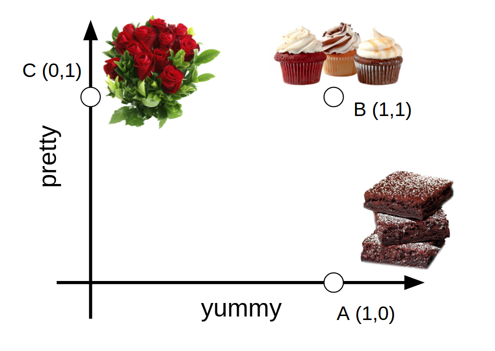
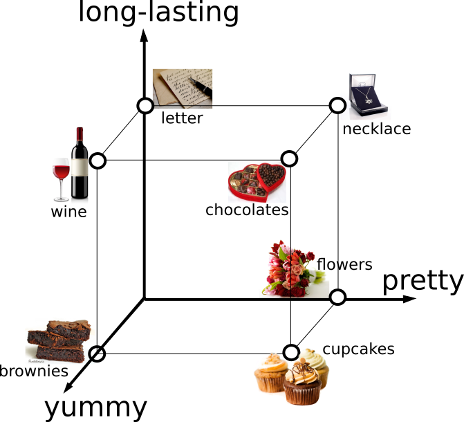

```{r}
knitr::opts_chunk$set(echo=F, warning=F, message=F)
```

```{r}
library(rwebppl)
library(ggplot2)
library(tidyr)
library(dplyr)
library(jsonlite)
library(ggthemes)
theme_new = theme_set(theme_few(base_size = 14))
```

```{r}
forward_model = webppl(
  program_file = "autonomous-robot-with-utility.wppl",
  inference_opts = list(method="enumerate"),
  model_var = "forwardModel",
  data = data.frame(a=1),
  data_var = "statesFromR", 
  packages = c("./node_modules/utilities")
)
```

## Central Example

Suppose an agent is choosing between 3 gifts: some kind of ugly but delicious brownies, some pretty but inedible flowers, and some adorable and delicious cupcakes. Here are these gifts in a 2D feature space of prettiness and yumminess:



Here are 4 possible utility functions that the agent could have and their corresponding distributions over choices.

```{r}
forward_model %>%
  mutate(prettiness=ifelse(prettiness==1, 'should be pretty', "prettiness: meh"),
         yumminess=ifelse(yumminess==1, 'should be yummy', "taste: meh")) %>%
  ggplot(., aes(x=action, y=prob, fill=action, colour=action)) +
  geom_bar(stat='identity') +
  scale_fill_few() +
  scale_colour_few() +
  facet_grid(prettiness ~ yumminess) +
  theme(axis.text.x = element_text(angle = -45, hjust = 0)) +
  theme(legend.position="none") +
  xlab("choice of gift")
```

Now given a particular gift choice made under a particular utility function, we can ask which terms in the utility function were most reponsible for the agent's selection.

```{r}
actualStates = data.frame(
  prettiness=c(0, 0, 0,
               0, 0,
               1, 1,
               1),
  yumminess=c(0, 0, 0,
              1, 1,
              0, 0,
              1),
  action=c("brownies", "cupcakes", "flowers",
           "brownies", "cupcakes",
           "cupcakes", "flowers",
           "cupcakes")
)
explanations.list = lapply(1:nrow(actualStates), function(i) {
  dataToWebPPL = actualStates[i,]
  return(webppl(
    program_file = "autonomous-robot-with-utility.wppl",
    inference_opts = list(method="enumerate"),
    model_var = "why",
    data = dataToWebPPL,
    data_var = "statesFromR", 
    packages = c("./node_modules/utilities")
  ))
})
explanations = do.call(rbind, explanations.list)
```

```{r}
explanationText = function(p, y, expl) {
  if (expl=="yumminess") {
    if (y==1) {
      return("b/c it should be yummy")
    } else {
      return("b/c taste doesn't matter")
    }
  } else {
    if (p==1) {
      return("b/c it should be pretty")
    } else {
      return("b/c prettiness doesn't matter")
    }
  }
}
# make some graphs!
explanations %>%
  mutate(
    explanationText=mapply(explanationText,
                           prettinessCoef,
                           yumminessCoef,
                           explanation),
    prettinessCoef=ifelse(prettinessCoef==1,
                          'should be pretty',
                          "prettiness: meh"),
    yumminessCoef=ifelse(yumminessCoef==1,
                         'should be yummy',
                         "taste: meh")) %>%
  ggplot(., aes(x=actionChoice, y=prob, fill=explanation, colour=explanation)) +
  geom_bar(stat="identity", position="dodge") +
  geom_text(aes(label=explanationText,
                x=actionChoice,
                group=explanation,
                y=0),
            position=position_dodge(0.9),
            colour='black',
            angle=90,
            hjust=-0.05,
            size=2) +
  facet_grid(prettinessCoef ~ yumminessCoef) +
  scale_fill_few() +
  scale_colour_few() +
  theme(axis.text.x = element_text(angle = -45, hjust = 0))
```

In general, if we pick an option that's high in one of the dimensions we care about, we tend to explain choosing it with, "Because I care about the dimension it's good on." When we pick an options that's low on a dimension we don't care about, we explain choosing it with, "Because I don't care about the dimension it's low on." Because of our high rationality, we never pick anything that's low on a dimension we care about.

So this is one simple example that seems to have the kind of behavior I expect. Let's increase the complexity. There are many choices of where to go from here. I'll list a few:

* modify the options
    - add an option at the origin
        * this will probably lead to a lot more symmetry, which might result in counterintuitively equally probable explanations
    - add multiple options at a particular point in feature space
    - subtract one or more options from the set of considered options
    - add options with fractional values in feature space
* change the possible utility functions
    - utility coefficients of features can be negative
    - certain coefficients are more likely than others
    - coeficients can have different magnitudes
* change the number of features
    - try 3 features next
* open up agent's choices to more randomness
    - lower rationality
    - uncertainty about action outcomes (noisy consequences of actions)
    - multi-step action planning, i.e. some choices open up other future choices
        * e.g. have a map we can move through with different transition probabilities
        
## 3D Feature Space Example

Probably the simplest change to make is increasing the feature space to 3 dimensions. Let's add a "long-lasting" dimension.



Here's the forward model in this case, for the different utility functions (now there are 8 combinations of coefficients).

```{r}
forward_model_3d = webppl(
  program_file = "autonomous-robot-with-utility.wppl",
  inference_opts = list(method="enumerate"),
  model_var = "forwardModel",
  data = data.frame(shelfLife="filler"),
  data_var = "statesFromR", 
  packages = c("./node_modules/utilities")
)
```

```{r}
forward_model_3d %>%
  mutate(utilityFunction = paste(prettiness, yumminess, shelfLife),
         action = factor(action, levels=c(
           "flowers", "necklace", "letter",
           "wine", "brownies", "cupcakes",
           "chocolates"))) %>%
  ggplot(., aes(x=action, y=prob, fill=action, colour=action)) +
  geom_bar(stat='identity') +
  scale_fill_few() +
  scale_colour_few() +
  facet_wrap(~utilityFunction) +
  theme(axis.text.x = element_text(angle = -45, hjust = 0)) +
  theme(legend.position="none") +
  xlab("choice of gift")
```

And we can look at the explanations.

```{r}
actualStates = data.frame(
  prettiness=c(0, 0, 0,
               0, 0, 0, 0,
               0, 0, 0, 0,
               0, 0, 0, 0,
               1, 1, 1, 1,
               0, 0,
               1, 1,
               1, 1,
               1),
  yumminess=c(0, 0, 0,
              0, 0, 0, 0,
              0, 0, 0, 0,
              1, 1, 1, 1,
              0, 0, 0, 0,
              1, 1,
              0, 0,
              1, 1,
              1),
  shelfLife=c(0, 0, 0,
              0, 0, 0, 0,
              1, 1, 1, 1,
              0, 0, 0, 0,
              0, 0, 0, 0,
              1, 1,
              1, 1,
              0, 0,
              1),
  action=c("brownies", "cupcakes", "flowers",
           "necklace", "wine", "letter", "chocolates",
           "necklace", "letter", "chocolates", "wine",
           "cupcakes", "chocolates", "brownies", "wine",
           "necklace", "chocolates", "cupcakes", "flowers",
           "chocolates", "wine",
           "necklace", "chocolates",
           "chocolates", "cupcakes",
           "chocolates")
)
explanations.list.3d = lapply(1:nrow(actualStates), function(i) {
  dataToWebPPL = actualStates[i,]
  return(webppl(
    program_file = "autonomous-robot-with-utility.wppl",
    inference_opts = list(method="enumerate"),
    model_var = "why",
    data = dataToWebPPL,
    data_var = "statesFromR", 
    packages = c("./node_modules/utilities")
  ))
})
explanations.3d = do.call(rbind, explanations.list.3d)
```

This takes forever to run, and the graphing probably doesn't work, but the version I ran on the command line seems to have anaologous behavior to the 2d version.

```{r}
explanations.3d %>%
  mutate(utilityFunction = paste(prettinessCoef, yumminessCoef, shelfLifeCoef),
         action = factor(action, levels=c(
           "flowers", "necklace", "letter",
           "wine", "brownies", "cupcakes",
           "chocolates"))) %>%
  ggplot(., aes(x=actionChoice, y=prob, fill=explanation, colour=explanation)) +
  geom_bar(stat="identity", position="dodge") +
  geom_text(aes(label=explanationText,
                x=actionChoice,
                group=explanation,
                y=0),
            position=position_dodge(0.9),
            colour='black',
            angle=90,
            hjust=-0.05,
            size=2) +
  facet_grid(prettinessCoef ~ yumminessCoef) +
  scale_fill_few() +
  scale_colour_few() +
  theme(axis.text.x = element_text(angle = -45, hjust = 0))
```