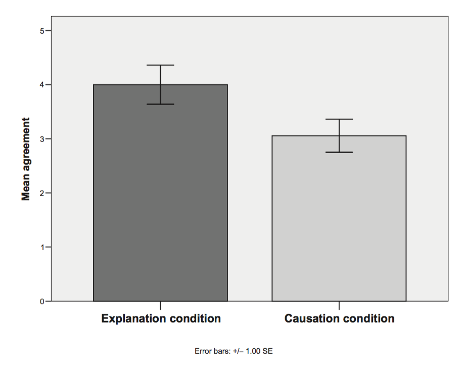

```{r global_options, include=FALSE}
rm(list=ls())
knitr::opts_chunk$set(
  echo=F, warning=F, #cache=T, 
  message=F, #sanitiz =T, 
  fig.width = 5, fig.height = 3)
```

In a sentence-rating experiment, @livengood_folk_2007 found that in some contexts participants were significantly more likely to endorse a sentence "B because A" than the corresponding sentence "A caused B", indicating that people do not conflate causal explanation and causation.



The following illustrates example stimuli from their experiments.

> > "Susan has to climb an old, worn-out rope in gym class. She wondered if it would support her weight. Susan was a very good climber. Though nervous, she climbed all the way to the rafters."
>
>In the causation condition, this short description was followed by the following question:
>
> > "On a scale of 1 to 7, 1 indicating that you totally disagree and 7 indicating that you totally agree, how much do you agree with the following claim? 'The rope not breaking caused Susan to reach the rafters.'"
>
>In the explanation condition, this short description was followed by the following question:
>
> > "On a scale of 1 to 7, 1 indicating that you totally disagree and 7 indicating that you totally agree, how much do you agree with the following claim? 'Susan reached the rafters because the rope did not break.'"